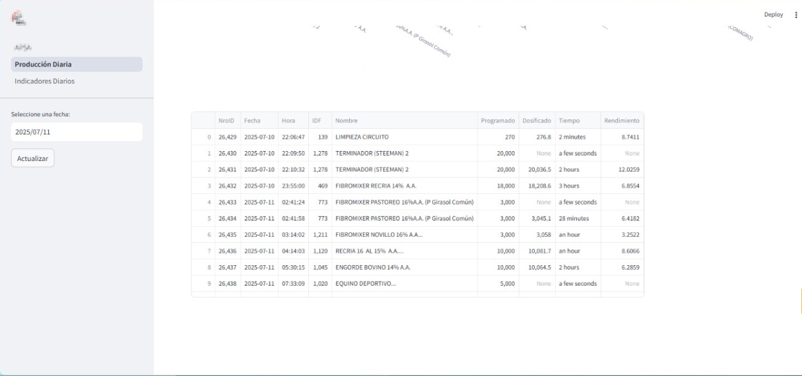

# Dashboard de Control de Producción - APSA

Este proyecto es una aplicación web desarrollada con Streamlit para visualizar y monitorear los datos de producción diaria de la planta. Se conecta a una base de datos MySQL para obtener datos en tiempo real y los presenta a través de métricas, gráficos y tablas interactivas.

## Características Principales

*   **Página de Bienvenida**: Pantalla principal de la aplicación.
*   **Producción Diaria**: Visualiza la cantidad producida por cada fórmula en un día específico, mostrando un gráfico de barras y los datos crudos en una tabla.
*   **Indicadores Diarios**: Muestra KPIs (Indicadores Clave de Rendimiento) como la producción total en toneladas, las horas totales de producción y un medidor de rendimiento (tn/h).
*   **Selector de Fecha**: Permite al usuario seleccionar cualquier fecha para consultar datos históricos.
*   **Actualización de Datos**: Botón para recargar los datos de la fecha seleccionada.

## Vistas de la Aplicación

A continuación se muestran algunas capturas de cómo se ve la aplicación en funcionamiento.

### Página Principal

*La página principal muestra el logo de la empresa y el título de la aplicación.*


### Producción Diaria

*En esta sección, el usuario puede ver un desglose de la producción por cada producto elaborado en la fecha seleccionada.*

`!Producción Diaria`




### Indicadores Diarios

*Esta página presenta los indicadores más importantes del día: producción total, horas de operación y el rendimiento promedio.*

`!Indicadores Diarios`


## Requisitos Previos

Asegúrate de tener instalado lo siguiente:
*   Python 3.8+
*   pip (Administrador de paquetes de Python)

## Instalación

Sigue estos pasos para configurar el entorno de desarrollo local.

1.  **Clona el repositorio:**
    ```bash
    git clone <URL_DEL_REPOSITORIO>
    cd APSA-DashboardProceso/streamlit
    ```

2.  **(Opcional pero recomendado) Crea y activa un entorno virtual:**
    *   En Windows:
        ```bash
        python -m venv venv
        .\venv\Scripts\activate
        ```
    *   En macOS/Linux:
        ```bash
        python3 -m venv venv
        source venv/bin/activate
        ```

3.  **Instala las dependencias:**
    El archivo `requeriment.txt` contiene todas las librerías necesarias.
    ```bash
    pip install -r requeriment.txt
    ```

## Configuración

La aplicación se conecta a una base de datos MySQL y requiere credenciales que no deben ser expuestas en el código. Streamlit maneja esto de forma segura a través de un archivo `secrets.toml`.

1.  Crea una carpeta llamada `.streamlit` en el directorio raíz del proyecto (`streamlit/`).
2.  Dentro de `.streamlit`, crea un archivo llamado `secrets.toml`.
3.  Añade tus credenciales de la base de datos al archivo con el siguiente formato:

    ```toml
    [mysql]
    host = "tu_host"
    user = "tu_usuario"
    password = "tu_contraseña"
    database = "dbp8100"
    ```

## Uso

Una vez que la instalación y configuración estén completas, puedes ejecutar la aplicación.

Desde la terminal, en el directorio `streamlit/`, ejecuta el siguiente comando:
```bash
streamlit run APSA.py
```
O, si estás en Windows, puedes simplemente ejecutar el archivo `iniciar_streamlit.bat`.

La aplicación se abrirá automáticamente en tu navegador web.

## Estructura del Proyecto

```
├── APSA.py                 # Script principal y página de bienvenida
├── pages/
│   ├── 01Producción_Diaria.py  # Lógica y layout de la página de producción
│   └── 02Indicadores_Diarios.py # Lógica y layout de la página de indicadores
├── images/                   # Directorio para logos y capturas de pantalla
├── .streamlit/
│   └── secrets.toml          # Archivo de configuración de credenciales (creado por el usuario)
├── requeriment.txt         # Dependencias de Python
└── iniciar_streamlit.bat   # Script para iniciar la app en Windows
```